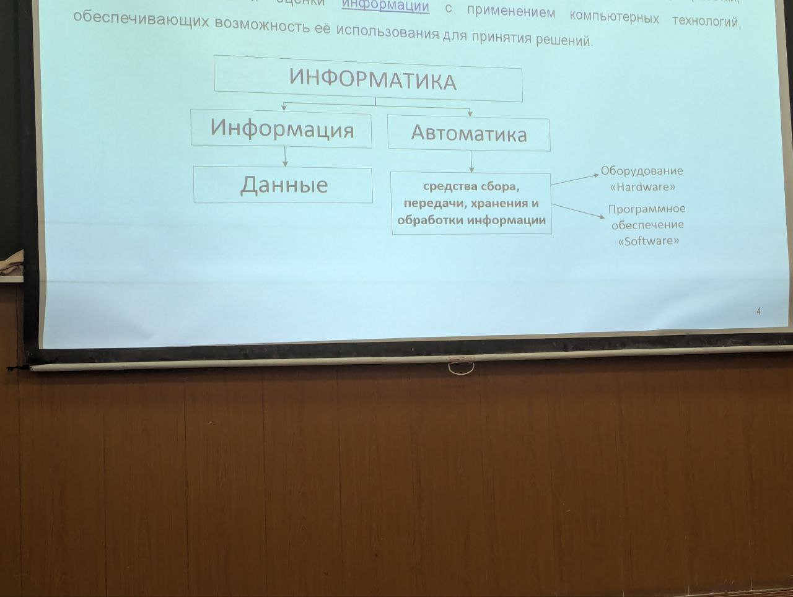
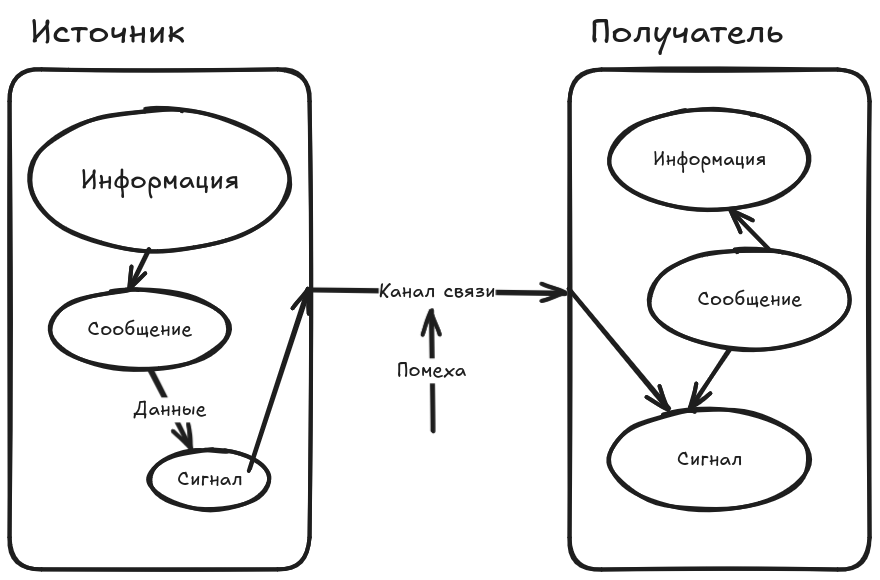

# Информатика как наука. Основные составляющие информационного процесса.
`Информатика` -- наука о методах и процессах сбора, хранения, обработки, передачи, анализа и оценки информации с применение компьютерных технологий, обеспечивающих возможность её исполльзования для принятия решений.

 

`Информация` -- любые сведения об объекте окружающего мира, являющихся
объектом хранения, передачи, преобразования и обработки.

Три подхода к информации:

- семантический подход
  
  содержательная часть информации (смысл)
- прагматический подход
  
  полезность для решения конкретной задачи
- синтаксический подход
  
  характеристики определяющие процессы хранения, передачи
  и алгоритмы обработки
  
В любом информационнос процессе можно выделить три основных компонента

 

1. Информация переносит знания об объекте, которых у получателя
   не было для получения сообщения
   
   Если у получателя есть данная информация, то это будет
   считаться данными
   
2. Информация не материальна (передать по каналу связи мы не можем)
   для передачи нужен материальный носитель
   
3. Информация может быть заключена в символах или знаках, а также в их взаимном расположении

`Сообщение` -- последовательность символов в которой заключена информация

Сообщение представленное в форме обеспечивающей его распознование называют данными (не материально)

Сообщение может быть передано по каналу связи с помощью материального
носителя.

Сигнал - изменение энергии однозначно связанный с передаваемыми символами

Символы и сигналы несут информацию только для получателя который их сможет распознать.

**Кодирование** -- правила и алгоритмы, по которым осуществляется 
процесс преобразования данных из формы необходимой для непосредственного
использования в форму воспринимаемую устройствами передачи и 
хранения и программным обеспечения.

Множество всех символов составляющих сообщений называют алфавитом

A = {a_1, a_2, ..., a_k}

Количество кодовых слов:

N = A^n
