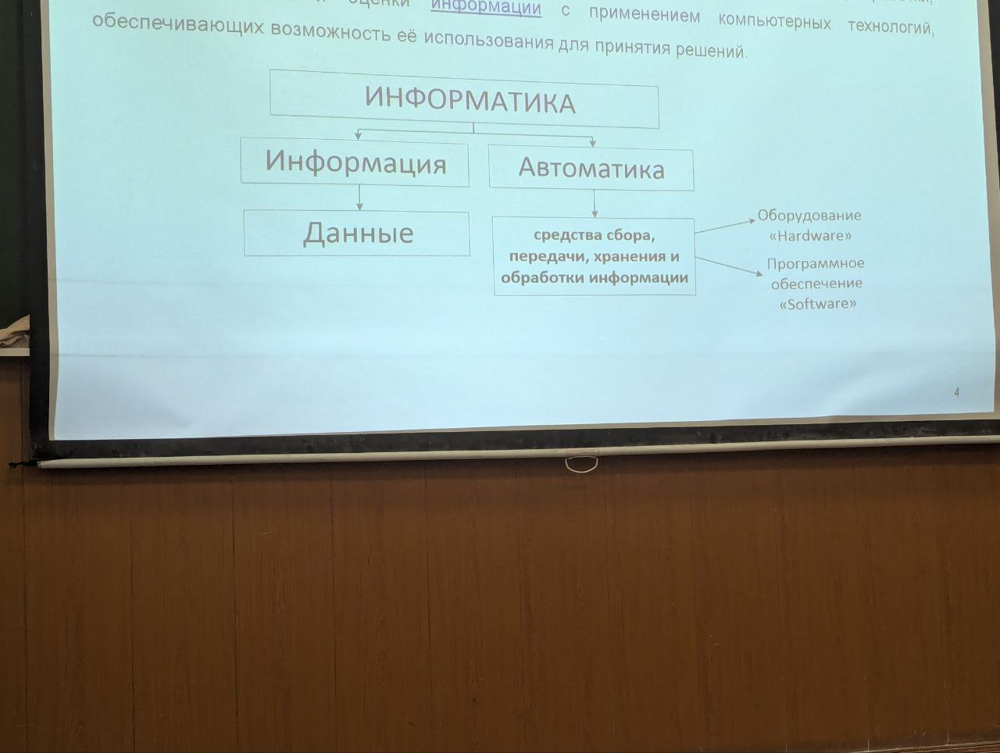

# Перевод из одной системы в другую

## Перевод из недесятичной в десятичную 

Перевод из q_u \neq 10 в q_k = 10 

Для того чтобы это сделать используем формулы из прошлой лекции.

B2C.31_8 = 12 + 2 * 16 + 11 * 16 ** 2 + 3/16 + 1/(16 ** 2)

## Перевод десятичную в недесятичную

### Перевод целого числа

Для перевода целого числа из десятичной в десятичную 
число нужно последовательно умножать на основание системы
счисления q_k до тех пор пока не будет получено
целое часть частного равная 0 (нулю).

Число в системе счисления с основанием q_k 
записывается в виде упорядоченной последовательности
остатков от деления в порядке обратном порядка их получения.

Пример:

### Перевод правильно дроби

Правильная дробь - целая часть равна 0

Для перевод правильной дроби из 
десятичной в недесятичную число нужно последовательно 
умножать на основание системы счисления q_k

Причём умножению подлежат только дробные части
промежуточных произведений. Умножение выполняем 
до тех пор пока не будет достигнута заданная точность.

Число в системе счисления с основание q_k 
записывается как упорядоченная последовательность
целых частей произведений в порядке их получения

Если точность вычислений задана как m-разрядов после запятой, 
то необходимо выполнить m+1 операцию умножения, округление по правилам математики.

 

### Неправильная дробь 

Для перевода неправильной дроби из десятичной в десятичную

Отдельно целая, отдельно дробная и складываем.

## Перевод из произвольной недесятичной системы в произвольную недесятичную

Для перевода числа из из произвольной недесятичной системы в произвольную недесятичную.

Переводят в десятичную и из десятичной в конечную 

